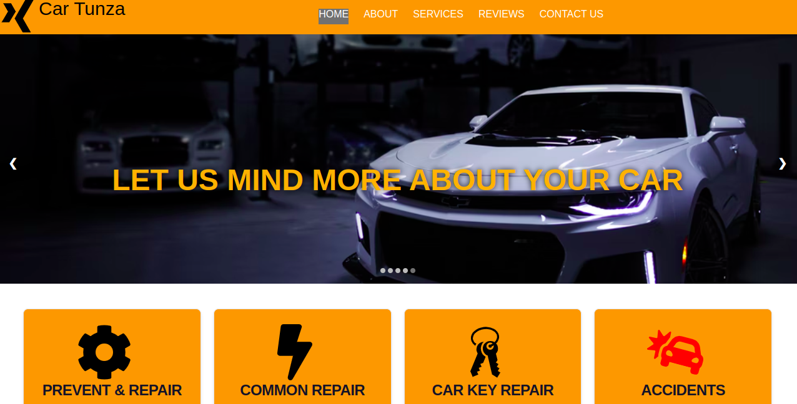
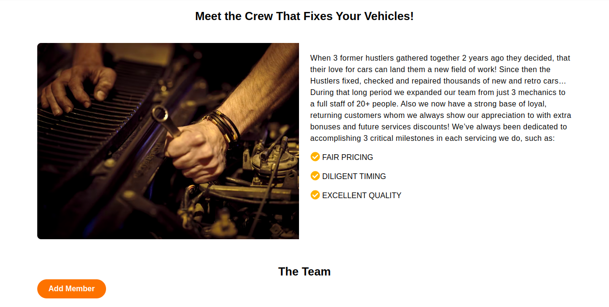
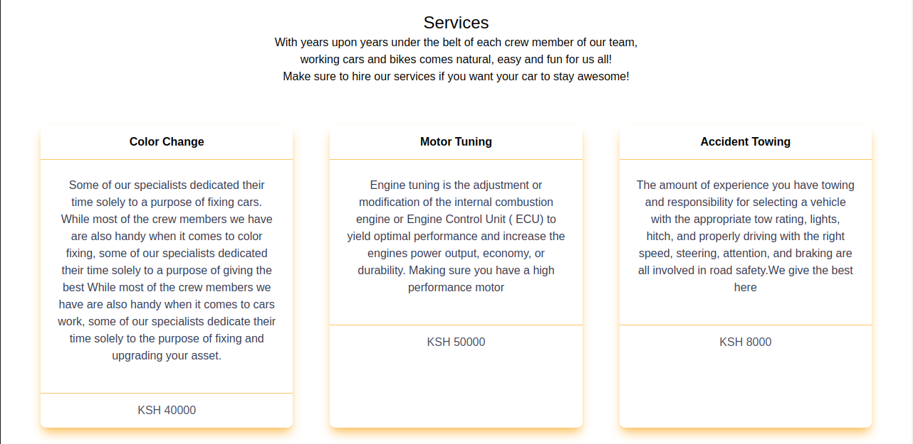
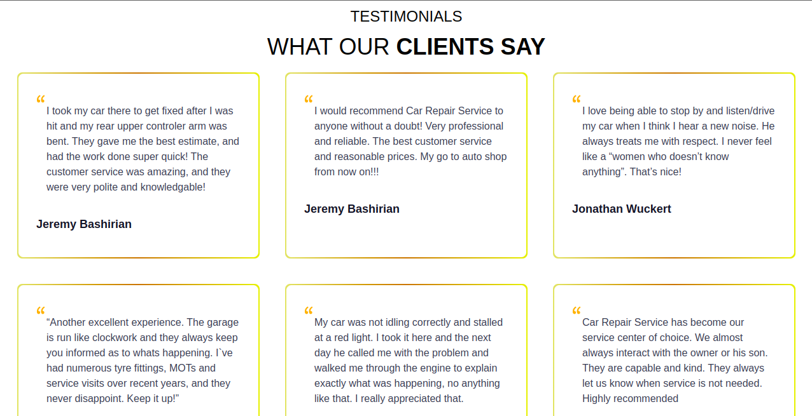

# Car Tunza

#### Created By Kelvin Nderitu on 08-09-2022

## Description

Car Tunza is a website application showing a crew of true auto enthusiast, all of whom are sincerely passionate about enhancing the performance and looks of your car!. Provides information of the garage crew.

## Setup Requirements

- Git
- Web-browser or your choice
- Github
- Node.js (https://nodejs.org/)
- NPM (https://www.npmjs.com/)
- Ruby 

### Installation

_Below is the is how you can install and setup my app. This template doesn't rely on any external dependencies or services._

1. Clone the repo
   ```sh
   git clone https://github.com/your_username_/Project-Name.git
   ```
2. Install NPM packages
   ```sh
   npm install
   ```

<!-- USAGE EXAMPLES -->

## Technologies Used

The following have been used on this project:

- HTML
- CSS
- Tailwind CSS
- React JS

#### Video link to view the project <a href="https://drive.google.com/file/d/1LGem62hwxZxwGbvzhkbdNgb_6cAf8Oqa/view?usp=sharing">View Car Tunza </a>

## Screenshots of the Web Application

- Homepage

  

- About

  

- Service

  

- Reviews

  


## Known Bugs

So far so good there are no bugs related to this project 😎

## Support and contact details 🙂

To make a contribution to the code used or any suggestions you can click on the contact link and email me your suggestions.

- Email: carreuky@gmail.com

## License

Copyright (c) 2022 Kelvin Nderitu.

The MIT License
License: MIT
[](https://opensource.org/licenses/MIT)
